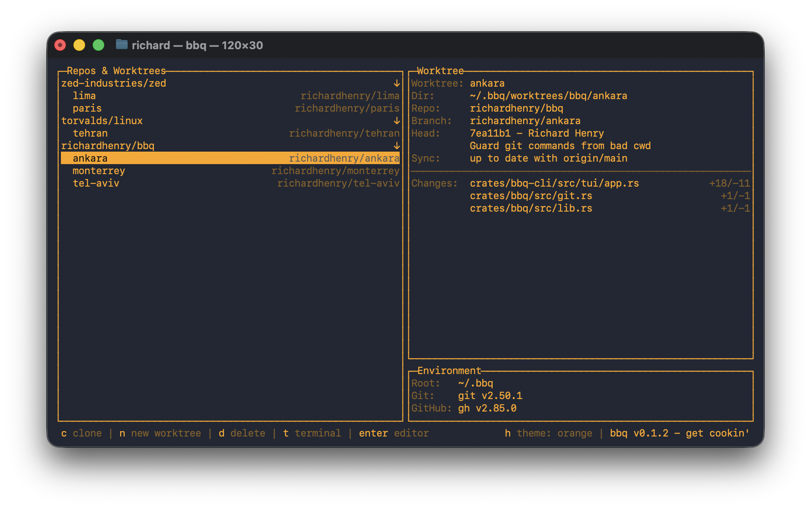

# bbq - get cookin'

`bbq` is a small/fast terminal UI and CLI that makes working with git worktrees a breeze.



## Requirements

- `git` on your PATH
- Optional: `cursor`, `code`, or `zed` on PATH for open in editor
- Optional: `gh` for owner/repo GitHub shorthand

## Install (Homebrew)

```sh
brew tap richardhenry/bbq
brew install bbq
```

Upgrade later with:

```sh
brew upgrade bbq
```

## Install (from source)

```sh
cargo build --release
```

The binary is `target/release/bbq` and can be copied to your path.

## Usage

Run `bbq` with no arguments to launch the TUI.

Alternatively, use directly through the CLI:

```sh
bbq repo clone <url-or-path> [name]
bbq repo list
bbq repo rm <name>

bbq worktree create <repo> [--branch <branch>]
bbq worktree list <repo>
bbq worktree open <repo> <name> [--target zed|cursor|vscode|terminal]
bbq worktree rm <repo> <name>
```

## Lifecycle scripts

### Post-create script

If a repo contains a post-create script at `.bbq/worktree/post-create`, `bbq` will run it automatically after creating a worktree. The script runs with the worktree as the current working directory.

The script type is determined by the shebang (`#!`) on the first line, so you can use any interpreter available on your system. For example:

```sh
#!/usr/bin/env bash
set -euo pipefail

# Build a devcontainer image for this worktree.
devcontainer build --workspace-folder .
```

If the script exits non-zero or is missing a shebang, worktree creation fails and the error is surfaced in the CLI/TUI. While the script is running in the TUI, a loading message appears: `Running post-create script ~/.../.bbq/worktree/post-create`.

### Pre-delete script

If a repo contains a pre-delete script at `.bbq/worktree/pre-delete`, `bbq` will run it automatically before deleting a worktree. The script runs with the worktree as the current working directory.

If the script exits non-zero or is missing a shebang, worktree deletion fails and the error is surfaced in the CLI/TUI. While the script is running in the TUI, a loading message appears: `Running pre-delete script ~/.../.bbq/worktree/pre-delete`.

## Configuration

`bbq` reads `~/.bbq/config.toml`. Example with macOS defaults:

```toml
root_dir = "~/.bbq"
theme = "orange"
github_user_prefix = true
check_updates = true
```

All configuration options:

| Option | Default (macOS) | Description |
| --- | --- | --- |
| `root_dir` | `~/.bbq` | Base directory for repos/worktrees. `BBQ_ROOT_DIR` overrides. |
| `theme` | `orange` | TUI accent color. |
| `editor` | unset (auto-detect `zed`, `cursor`, `code`) | Command/app to open worktrees. Used by TUI and CLI when no `--target` is provided. |
| `terminal` | unset (uses Terminal.app) | Command/app to open a terminal at a worktree path. On Linux, auto-detects common terminals. |
| `github_user_prefix` | `true` | Prefix new branch names with your GitHub username (requires `gh`). |
| `default_worktree_name` | unset | If set to `cities`, new worktrees default to a random city slug (for example `san-francisco`). |
| `check_updates` | `true` | Check for Homebrew updates and show the upgrade prompt. |
| `known_latest_version` | unset (internal) | Last version seen by the background update check; managed by `bbq`. |

The environment variable `BBQ_ROOT_DIR` overrides `root_dir`.

### Terminal support (Unix-like)

If no `terminal` is configured, `bbq` tries common terminal emulators in order (`wezterm`, `alacritty`, `kitty`, `gnome-terminal`, `konsole`, `xfce4-terminal`, `x-terminal-emulator`, then `xterm`). Configure `terminal` if you use something else.

### Default branch behavior

If `--branch` is omitted, `bbq` tries to use the repo's default branch in this order:

1. `origin/HEAD` (if set)
2. the bare repo's `HEAD` branch
3. `origin/main`, `origin/master`, `main`, `master`

If none exist, it falls back to `main`.

## License

MIT. See `LICENSE`.
